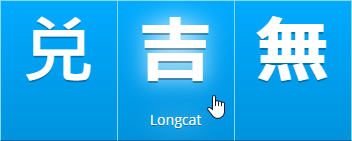

# WaniKani Hider

Hides solutions until you hover while browsing content by level on [WaniKani](https://www.wanikani.com/) (a great website for learning japanese kanji). Useful for doing self-study outside of the prescribed reviews.

## Instructions

1) Install [Tampermonkey](http://tampermonkey.net/) or [Greasemonkey](https://addons.mozilla.org/en-US/firefox/addon/greasemonkey/)
2) Install [wanikani-hider.user.js](https://github.com/davidluzgouveia/wanikani-hider/raw/master/wanikani-hider.user.js)
